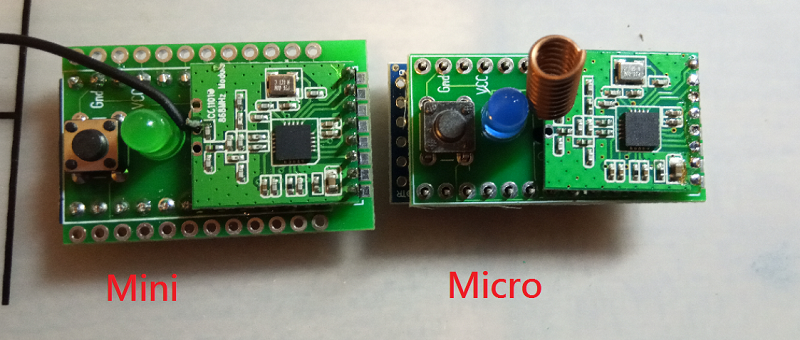

# HB-Micro - Homematic 868Mhz
## benötigte Hardware
 * 1x Arduino Pro Mini **ATmega328P (3.3V/8MHz)**
 * 1x CC1101 Funkmodul **(868 MHz)**
 * 1x FTDI Adapter (wird nur zum Flashen benötigt)
* 1x Taster 6*6
* 1x LED 5mm
* 1x Widerstand 330 Ohm

Abmaße: 36 x 19 mm

[Software je nach Projekt](https://github.com/jp112sdl) von Jérôme

